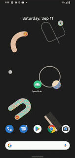
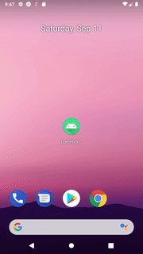

# Open Flickr Viewer

Open Flickr Viewer is an Android app that display photos from the Flickr server using Flickr REST API.

## Features

- Search for related photos on the Flickr server using **specific terms**.
- Load **25 photos at a time** from the Flickr server.
- Load **next 25 photos** if you **scroll down** on the Photo List screen.
- Save the imported photos and descriptions to **local data storage**.
- View the photo and title on the Photo Detail screen, when selecting a photo on the Photo List screen.
- View the photo on the Photo screen with the zoom function, when selecting the photo on the Photo Detail screen
- Save the search terms using **SearchRecentSuggestionsProvider in Android platform** for the quick search option.
- Support **9** unit test cases and **8** UI test cases including **fragment navigation**, **network timeout**, and **error dialog**.

**DEMO**

>Full demo on YouTube
- [To YouTube!](https://youtu.be/mLQexJPcnHY)

**UI TEST DEMO**

## Built with

> Open Flickr Viewer is architectured using MVVM (Model-View-Viewmodel) pattern with variety of Android Jetpack's Architecture Components.

* [Android Jetpack - Architecture Component](https://developer.android.com/topic/libraries/architecture)
* [Android Jetpack - ViewModel](https://developer.android.com/topic/libraries/architecture/viewmodel)
* [Android Jetpack - Navigation](https://developer.android.com/guide/navigation)
* [Android Jetpack - LiveData](https://developer.android.com/topic/libraries/architecture/livedata)
* [Android Jetpack - Room](https://developer.android.com/topic/libraries/architecture/room)
* [Android SearchRecentSuggestionsProvider](https://developer.android.com/reference/android/content/SearchRecentSuggestionsProvider)
* [Kotlin Flows](https://developer.android.com/kotlin/flow)
* [Kotlin Coroutines](https://kotlinlang.org/docs/reference/coroutines-overview.html)
* [Dagger](https://dagger.dev/)
* [Gson](https://github.com/google/gson)
* [Retrofit](https://square.github.io/retrofit/)
* [OkHttp](https://square.github.io/okhttp/4.x/okhttp/okhttp3/)
* [Glide](https://github.com/bumptech/glide)
* [AndroidX Test](https://developer.android.com/jetpack/androidx/releases/test)
* [JUnit](https://junit.org/junit4/)
* [MockK](https://mockk.io/)

---

## Authors

* **Jong Ho Baek**
